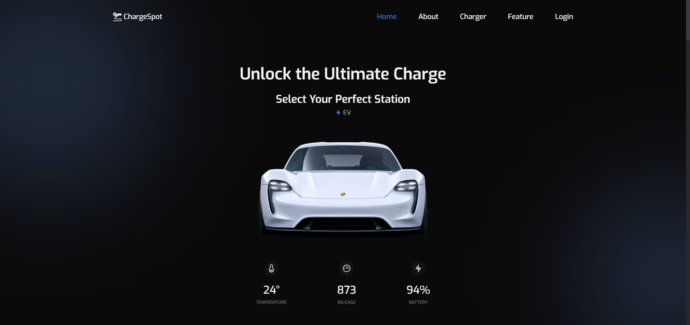
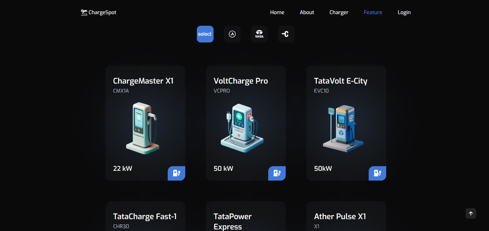
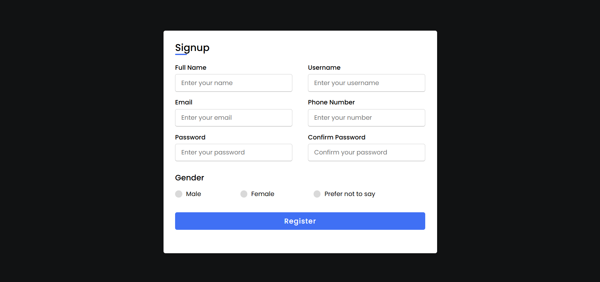
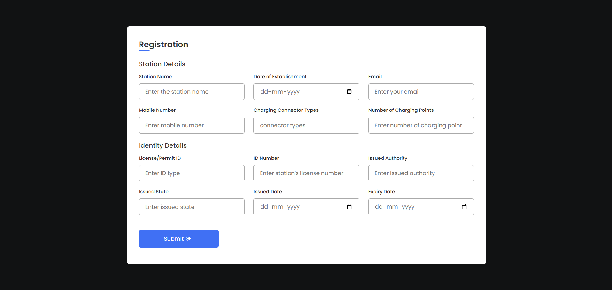

# ⚡ ChargeSpot – EV Charging Station Landing Page

**ChargeSpot** is a responsive and modern **EV charging station landing page** built with **HTML**, **CSS**, and **JavaScript**. It features a sleek home layout with fully functional **Sign In** and **Sign Up** pages — perfect for a green-tech or electric vehicle startup website.

## 🚀 Live Demo

👉 [Live App](https://charge-spot.vercel.app/)

## 🛠️ Tech Stack

- **HTML5**
- **CSS3**
- **Vanilla JavaScript**

## ✨ Features

- EV-focused landing page UI
- Separate **Sign In** and **Sign Up** pages
- Clean, mobile-friendly design
- Smooth layout and navigation
- User-first structure with CTA buttons## 📸 Screenshot

## 📚 Ideal For

- Clean energy startups
- EV charging networks
- Frontend login/signup UI practice
- Responsive landing page design

## 📫 Contact Me

- **📧 Email:** muhdzaheermv@gmail.com  
- **🔗 Portfolio:** [https://portfolio-lilac-eight-60.vercel.app/](https://portfolio-lilac-eight-60.vercel.app/)  
- **💼 LinkedIn:** [https://www.linkedin.com/in/muhammed-zaheer-836132244/](https://www.linkedin.com/in/muhammed-zaheer-836132244/)

## ⭐ Like This Project?

If you liked the design or want to use it for your own project, please **⭐ star** the repo — every bit of support helps me build more!

